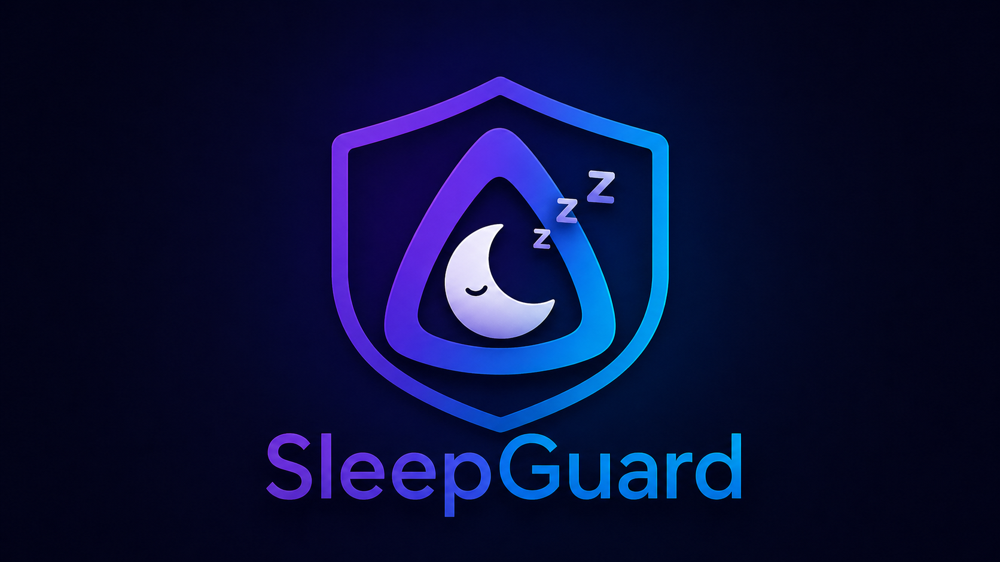
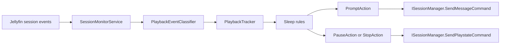

<div align="center">
  <picture>
    
  </picture>
  <br>
  <br>
  
  
  
  
  
  
  
</div>

# SleepGuard for Jellyfin

SleepGuard is a server-side Jellyfin plugin that pauses or stops playback when a session looks like it has turned into an overnight autoplay run. The plugin ships with a Jellyfin-themed admin page, English and Italian settings text, localized prompt defaults, and an optional full-screen Jellyfin Web overlay.

## Why

Jellyfin does not currently include a Netflix-style "Are you still watching?" prompt. If someone falls asleep during a binge, playback can continue for hours, wasting bandwidth and leaving the user far from their real resume position. SleepGuard watches active sessions on the server and acts when configurable limits are reached.

## Screenshots

Admin configuration and triggered-pause screenshots will be added before the first release.

## Features

- Continuous playback limit, measured in wallclock playing time.
- Autoplay episode limit for episode chains in the same series.
- Optional active time window such as `22:00` to `07:00`.
- Pause or stop action when a rule fires.
- Best-effort Jellyfin client toast using `SendMessageCommand`.
- Optional Jellyfin Web companion overlay with a full-screen continue button.
- English and Italian settings page text, prompt defaults, and overlay labels.
- Per-user scope with all-users, whitelist, and blacklist modes.
- Configurable opt-outs for movies, music, and Live TV.
- Testing and diagnostics controls separated from normal playback settings.
- Embedded SleepGuard logo for the plugin settings page and repository metadata.

## Compatibility

| Component               | Support                                                                 |
| ----------------------- | ----------------------------------------------------------------------- |
| Jellyfin Server         | 10.11.x                                                                 |
| Target framework        | .NET 9.0                                                                |
| Settings languages      | English, Italian                                                        |
| Web client prompt       | Supported                                                               |
| Web full-screen overlay | Supported with optional `client/sleepguard-overlay.js` companion script |
| iOS prompt              | Expected to work where message commands are honored                     |
| Android TV prompt       | Toast may not appear; pause or stop still works                         |
| Other clients           | Pause or stop depends on standard Jellyfin media-control support        |

## Installation

Add the repository URL in Dashboard -> Plugins -> Repositories, then install SleepGuard from the catalog.

Manual installation:

1. Download the release `.zip`.
2. Extract it into `<jellyfin-data>/plugins/SleepGuard_<version>/`.
3. Restart Jellyfin.
4. Open Dashboard -> Plugins -> SleepGuard.

## Configuration

Normal usage settings:

| Setting                |                   Default | Meaning                                                        |
| ---------------------- | ------------------------: | -------------------------------------------------------------- |
| `Enabled`              |                    `true` | Master switch.                                                 |
| `Action`               |                   `Pause` | Send pause or stop when a rule fires.                          |
| `MaxContinuousMinutes` |                     `120` | Continuous playing minutes before action; `0` disables.        |
| `MaxAutoplayEpisodes`  |                       `3` | Episode-chain count before action; `0` disables.               |
| `OnlyWithinTimeWindow` |                   `false` | Only evaluate limits inside the configured clock window.       |
| `TimeWindowStart`      |                `22:00:00` | Server-local window start.                                     |
| `TimeWindowEnd`        |                `07:00:00` | Server-local window end; midnight wrap is supported.           |
| `IncludeMovies`        |                    `true` | Apply continuous-time limits to movies.                        |
| `IncludeMusic`         |                   `false` | Apply continuous-time limits to music.                         |
| `IncludeLiveTv`        |                   `false` | Apply continuous-time limits to Live TV.                       |
| `UserMode`             |                `AllUsers` | All users, whitelist, or blacklist.                            |
| `UserIds`              |                     empty | User IDs used by whitelist or blacklist mode.                  |
| `SendPrompt`           |                    `true` | Send a best-effort client message before action.               |
| `Language`             |                      `en` | `en` or `it`; controls settings text and default prompt text.  |
| `PromptHeader`         |              `SleepGuard` | Header text for clients that show message headers.             |
| `PromptMessage`        | `Are you still watching?` | Text sent to clients that support messages; Italian default is `Stai ancora guardando?`. |
| `PromptTimeoutSeconds` |                       `8` | Suggested client toast display duration.                       |
| `PromptGraceSeconds`   |                      `30` | Delay after prompt before pause or stop; `0` acts immediately. |

Testing and diagnostics settings:

| Setting                       | Default | Meaning                                                                 |
| ----------------------------- | ------: | ----------------------------------------------------------------------- |
| `MaxContinuousSeconds`        |     `0` | Testing override for the continuous-time rule; `0` uses minutes.        |
| `DryRun`                      | `false` | Log the final pause/stop action without sending it.                     |
| `ActionRepeatCount`           |     `1` | Send pause/stop more than once for clients that miss the first command. |
| `ActionRepeatIntervalSeconds` |     `2` | Delay between repeated action attempts.                                 |
| `LogProgressEvents`           | `false` | Log every playback progress event.                                      |
| `LogRuleChecks`               | `false` | Log every rule evaluation and outcome.                                  |

## How It Works



The plugin subscribes to playback events in a hosted service, keeps one in-memory tracker per Jellyfin session, evaluates gate and trigger rules after each update, then sends Jellyfin session commands when a limit fires.

## Development

One-command repository build:

```powershell
.\scripts\Build-PluginRepository.ps1 -Version 0.1.0.10
```

Build, test, generate `manifest.json`, commit/push it, and create the GitHub release with the plugin zip:

```powershell
.\scripts\Build-PluginRepository.ps1 -Version 0.1.0.10 -CommitAndPush -CreateRelease
```

For the first release from a fresh repo, include all project files in the commit:

```powershell
.\scripts\Build-PluginRepository.ps1 -Version 0.1.0.10 -CommitAndPush -StageAll -CreateRelease
```

The Jellyfin repository URL is:

```text
https://raw.githubusercontent.com/thisispivi/JellyfinSleepGuard/main/manifest.json
```

Optional full-screen web overlay:

```text
client/sleepguard-overlay.js
```

Paste that script into a Jellyfin JavaScript injection plugin if you want the web client to pause immediately and show a full-page "Are you still watching?" overlay with a continue button when SleepGuard sends its prompt. The overlay only appears when Jellyfin Web has an active video element, so it will not cover the dashboard, settings, or library pages.

The overlay defaults to the browser language for English or Italian labels. You can override `window.SleepGuardOverlay.settings` after loading the script if you want custom text.

Build:

```powershell
dotnet build Jellyfin.Plugin.SleepGuard.sln
```

Run tests:

```powershell
dotnet test Jellyfin.Plugin.SleepGuard.sln
```

Check package health before publishing:

```powershell
dotnet list Jellyfin.Plugin.SleepGuard.sln package --vulnerable --include-transitive
dotnet list Jellyfin.Plugin.SleepGuard.sln package --deprecated
git diff --check
```

Publish for a local Jellyfin server:

```powershell
dotnet publish src/Jellyfin.Plugin.SleepGuard/Jellyfin.Plugin.SleepGuard.csproj -c Release
New-Item -ItemType Directory -Force "<jellyfin-data>\plugins\SleepGuard_0.1.0.0"
Copy-Item "src\Jellyfin.Plugin.SleepGuard\bin\Release\net9.0\publish\Jellyfin.Plugin.SleepGuard.dll" "<jellyfin-data>\plugins\SleepGuard_0.1.0.0\"
```

Restart Jellyfin after copying the DLL. For live testing, set `MaxContinuousMinutes=0`, `MaxContinuousSeconds=15`, `PromptGraceSeconds=0`, and `ActionRepeatCount=3`, then watch the Jellyfin logs while playing from a web client.

## Troubleshooting

| Log line                                | Meaning                                                                    |
| --------------------------------------- | -------------------------------------------------------------------------- |
| `SleepGuard session monitor started`    | The hosted service loaded and subscribed to session events.                |
| `Rule ContinuousTimeRule fired`         | The continuous-time threshold was reached.                                 |
| `Rule AutoplayEpisodeRule fired`        | The episode-chain threshold was reached.                                   |
| `SleepGuard sent prompt`                | The toast path worked and final action was scheduled or sent immediately.  |
| `SleepGuard sent Pause command attempt` | The server sent a media-control command to the client.                     |
| `SleepGuard dry run`                    | Diagnostics mode is enabled; no pause/stop command was sent.               |
| `failed to send prompt`                 | The client may not support message commands; pause or stop can still work. |
| `failed to send Pause command`          | The client session did not accept remote media control.                    |

## Contributing

Issues and pull requests are welcome. Please keep changes focused, run `dotnet test`, and follow the analyzer and `.editorconfig` settings in the repository.

## Roadmap

- Persist trackers across server restarts.
- Per-user thresholds.
- More built-in translations.

## License

GPL-2.0-only. See [LICENSE](LICENSE).
