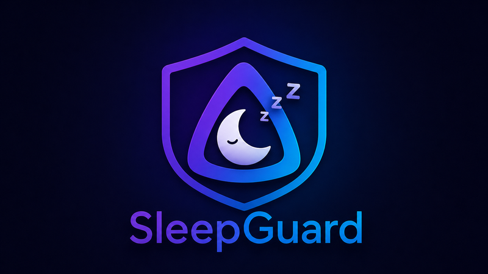
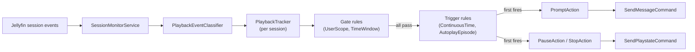

<div align="center">
  <picture>
    
  </picture>
  <br>
  <br>
  
  
  
  
  
  
  
</div>

# SleepGuard for Jellyfin

SleepGuard is a server-side Jellyfin plugin that pauses or stops playback when a session looks like it has turned into an overnight autoplay run. It ships with a Jellyfin-themed admin settings page, English and Italian UI text, localized prompt defaults, and an optional full-screen web overlay with a continue button.

## Quick Start

1. **Install** — Add the plugin repository URL in Dashboard → Plugins → Repositories, then install SleepGuard from the catalog and restart Jellyfin.

   ```
   https://raw.githubusercontent.com/thisispivi/JellyfinSleepGuard/main/manifest.json
   ```

2. **Configure** — Open Dashboard → Plugins → SleepGuard. The defaults (2-hour continuous limit, 3-episode autoplay limit, pause action) work for most setups.

3. **Enable the overlay** — Copy the overlay URL shown in the **Customization → Overlay Setup** section of the settings page and register it in the [Jellyfin JavaScript Injector](https://github.com/n00bcodr/Jellyfin-JavaScript-Injector) plugin. The overlay displays a full-screen "Are you still watching?" prompt that matches your Jellyfin theme.

> **No overlay plugin?** You can also paste `import('/SleepGuard/overlay.js').catch(()=>{});` into Dashboard → General → Branding → Custom JavaScript. SleepGuard already works without any overlay — the server-side action (pause/stop) fires regardless of what the browser is doing.

## Features

- Continuous playback limit in wallclock minutes.
- Autoplay episode limit for episode chains within the same series.
- Optional active-hours time window (e.g. 22:00–07:00, midnight-wrap supported).
- Pause or stop action when a rule fires.
- Best-effort Jellyfin client toast via `SendMessageCommand`.
- Full-screen web overlay with continue/dismiss buttons, backdrop image support, live-preview appearance editor.
- Keyboard shortcuts on overlay: **Enter** (continue), **Escape** (dismiss).
- English and Italian settings page and prompt text; more languages are easy to add.
- Per-user scope: all users, whitelist, or blacklist.
- Media-type opt-outs: movies, music, Live TV.
- Developer Tools tab (hidden by default) with dry-run, fast-fire overrides, and an in-browser overlay test button.

## Compatibility

| Component               | Support                                                        |
| ----------------------- | -------------------------------------------------------------- |
| Jellyfin Server         | 10.11.x                                                        |
| Target framework        | .NET 9.0                                                       |
| Settings languages      | English, Italian                                               |
| Web full-screen overlay | `/SleepGuard/overlay.js` — register in JS Injector or Branding |
| iOS prompt              | Expected to work where message commands are honored            |
| Android TV prompt       | Toast may not appear; pause/stop still fires                   |
| Other clients           | Pause/stop depends on standard Jellyfin media-control support  |

## Installation

**From the plugin catalog (recommended):**

1. Dashboard → Plugins → Repositories → Add repository URL above.
2. Install SleepGuard from the catalog.
3. Restart Jellyfin.

**Manual:**

1. Download the release `.zip`.
2. Extract into `<jellyfin-data>/plugins/SleepGuard_<version>/`.
3. Restart Jellyfin.
4. Open Dashboard → Plugins → SleepGuard.

On Linux with systemd: `sudo systemctl restart jellyfin`.

## Configuration Reference

Settings are organised into three tabs in the plugin admin page.

<details>
<summary><strong>Behavior</strong> — controls when and for whom the plugin acts</summary>

| Setting                |    Default | Meaning                                                         |
| ---------------------- | ---------: | --------------------------------------------------------------- |
| `Enabled`              |     `true` | Master on/off switch.                                           |
| `Action`               |    `Pause` | Send pause or stop when a rule fires.                           |
| `MaxContinuousMinutes` |      `120` | Continuous playing minutes before action; `0` disables.         |
| `MaxAutoplayEpisodes`  |        `3` | Episode-chain count before action; `0` disables.                |
| `OnlyWithinTimeWindow` |    `false` | Only evaluate limits inside the configured clock window.        |
| `TimeWindowStart`      | `22:00:00` | Server-local window start.                                      |
| `TimeWindowEnd`        | `07:00:00` | Server-local window end; midnight wrap is supported.            |
| `IncludeMovies`        |     `true` | Apply continuous-time limits to movies.                         |
| `IncludeMusic`         |    `false` | Apply continuous-time limits to music.                          |
| `IncludeLiveTv`        |    `false` | Apply continuous-time limits to Live TV.                        |
| `UserMode`             | `AllUsers` | All users, whitelist, or blacklist.                             |
| `UserIds`              |  _(empty)_ | User GUIDs for whitelist / blacklist mode.                      |
| `SendPrompt`           |     `true` | Send a best-effort client toast before action.                  |
| `DeveloperMode`        |    `false` | Reveals the Developer Tools tab. Disable on production servers. |

</details>

<details>
<summary><strong>Customization</strong> — controls the prompt text and overlay appearance</summary>

| Setting                       |                   Default | Meaning                                                              |
| ----------------------------- | ------------------------: | -------------------------------------------------------------------- |
| `Language`                    |                      `en` | `en` or `it`; controls settings text and default prompt text.        |
| `PromptHeader`                |              `SleepGuard` | Header text for clients that show toast headers.                     |
| `PromptMessage`               | `Are you still watching?` | Body text sent to clients; Italian default: _Stai ancora guardando?_ |
| `PromptTimeoutSeconds`        |                       `8` | Suggested client toast display duration (1–∞).                       |
| `PromptGraceSeconds`          |                      `30` | Delay after prompt before pause/stop fires; `0` acts immediately.    |
| `OverlayAccentColor`          |                 `#00a4dc` | CSS hex color for the continue button.                               |
| `OverlayBackgroundOpacity`    |                      `92` | Overlay background darkness (0–100).                                 |
| `OverlayUseBackdropImage`     |                   `false` | Use the current Jellyfin backdrop image behind the overlay.          |
| `OverlayBlurBackdrop`         |                    `true` | Blur the backdrop image (only when backdrop is enabled).             |
| `OverlayShowContinueButton`   |                    `true` | Show the continue-watching button on the overlay.                    |
| `OverlayShowDismissButton`    |                    `true` | Show the stay-paused button on the overlay.                          |
| `OverlayContinueButtonTextEn` |                  _(null)_ | English override for the continue button label.                      |
| `OverlayContinueButtonTextIt` |                  _(null)_ | Italian override for the continue button label.                      |
| `OverlayDismissButtonTextEn`  |                  _(null)_ | English override for the dismiss button label.                       |
| `OverlayDismissButtonTextIt`  |                  _(null)_ | Italian override for the dismiss button label.                       |

</details>

<details>
<summary><strong>Developer Tools</strong> — hidden unless <code>DeveloperMode = true</code>; for testing only</summary>

| Setting                       | Default | Meaning                                                                  |
| ----------------------------- | ------: | ------------------------------------------------------------------------ |
| `MaxContinuousSeconds`        |     `0` | Testing override for the continuous-time rule; `0` uses minutes setting. |
| `DryRun`                      | `false` | Log the final pause/stop action without actually sending it.             |
| `ActionRepeatCount`           |     `1` | Send pause/stop this many times (1–5) for unreliable clients.            |
| `ActionRepeatIntervalSeconds` |     `2` | Delay between repeated action attempts (0–30 s).                         |
| `LogProgressEvents`           | `false` | Log every playback progress event at Information level.                  |
| `LogRuleChecks`               | `false` | Log every rule evaluation and its outcome at Information level.          |

> When Developer Tools are enabled, the keyboard shortcut **Ctrl+Shift+Alt+S** shows the overlay in the current browser window for quick visual testing. The settings page also has a **Show Overlay (test)** button.

</details>

## How It Works


```mermaid
flowchart LR
  A["Jellyfin session events"] --> B["SessionMonitorService"]
  B --> C["PlaybackEventClassifier"]
  C --> D["PlaybackTracker\n(per session)"]
  D --> E["Gate rules\n(UserScope, TimeWindow)"]
  E -- "all pass" --> F["Trigger rules\n(ContinuousTime, AutoplayEpisode)"]
  F -- "first fires" --> G["PromptAction"]
  F -- "first fires" --> H["PauseAction / StopAction"]
  G --> I["SendMessageCommand"]
  H --> J["SendPlaystateCommand"]
```

`SessionMonitorService` subscribes to Jellyfin playback events as a hosted service. For each progress event it updates an in-memory `PlaybackTracker`, then runs the gate rules (which can short-circuit evaluation entirely) followed by the trigger rules. When a trigger fires it sends a prompt toast and schedules the final pause/stop after the configured grace period.

See [`docs/ARCHITECTURE.md`](docs/ARCHITECTURE.md) for a full layer diagram, rule pipeline details, configuration lifecycle, and guides for adding new rules or languages.

## Overlay Setup

SleepGuard self-hosts the overlay at `/SleepGuard/overlay.js`. Your current plugin settings are baked in at request time so changing a setting takes effect immediately on the next page load — no rebuild required.

**With Jellyfin JavaScript Injector (recommended):**

1. Copy the overlay URL from Dashboard → Plugins → SleepGuard → Customization → **Overlay Setup**.
   The URL is `https://<your-server>/SleepGuard/overlay.js`.
2. Paste it into the [Jellyfin JavaScript Injector](https://github.com/n00bcodr/Jellyfin-JavaScript-Injector) plugin settings.
3. Save. The overlay loads automatically on every Jellyfin web page.

**Without the JS Injector (Branding field):**

1. Dashboard → General → Branding → Custom JavaScript.
2. Paste:
   ```js
   import("/SleepGuard/overlay.js").catch(() => {});
   ```
3. Save.

## Development

**Prerequisites:** .NET 9 SDK, Node 20 (for the TypeScript overlay build).

```bash
# Build (Linux/macOS)
make build

# Run tests
make test

# Type-check the overlay TypeScript
make client-check

# Deploy to a local Linux Jellyfin (systemd)
make deploy-local
```

```powershell
# Build (Windows)
dotnet build Jellyfin.Plugin.SleepGuard.sln

# Run tests
dotnet test Jellyfin.Plugin.SleepGuard.sln

# Build and publish a release zip
.\scripts\Build-PluginRepository.ps1 -Version 0.1.0.11
```

See [`CONTRIBUTING.md`](CONTRIBUTING.md) for the full development guide: branch naming, commit conventions, local deploy steps, and the PR checklist.

## Troubleshooting

| Log line                                | Meaning                                                                 |
| --------------------------------------- | ----------------------------------------------------------------------- |
| `SleepGuard session monitor started`    | The hosted service loaded and subscribed to session events.             |
| `Rule ContinuousTimeRule fired`         | The continuous-time threshold was reached.                              |
| `Rule AutoplayEpisodeRule fired`        | The episode-chain threshold was reached.                                |
| `SleepGuard sent prompt`                | The toast path worked; final action scheduled or sent immediately.      |
| `SleepGuard sent Pause command attempt` | The server sent a media-control command to the client.                  |
| `SleepGuard dry run`                    | Developer mode dry-run is on; no pause/stop command was sent.           |
| `failed to send prompt`                 | Client may not support message commands; pause/stop can still work.     |
| `failed to send Pause command`          | The client session did not accept remote media control.                 |
| `404 on /SleepGuard/overlay.js`         | Plugin DLL was not built with the embedded overlay resource.            |
| Overlay not appearing in browser        | Verify the URL is registered in JS Injector; check the browser console. |

## Contributing

See [CONTRIBUTING.md](CONTRIBUTING.md). Issues and pull requests are welcome.

## License

GPL-2.0-only. See [LICENSE](LICENSE).
